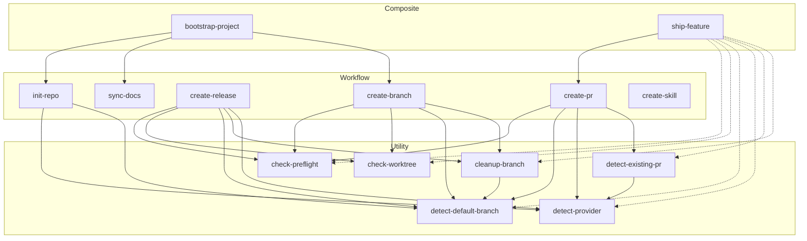

# Skill Architecture

14 skills arranged in three layers. Each layer composes the one below it.



## Layers

### Utility — reusable building blocks

Single-purpose skills that read context or validate state. No side effects beyond aborting.

| Skill | Purpose |
|---|---|
| `check-preflight` | Abort if not a git repo or no remote |
| `check-worktree` | Abort if uncommitted changes |
| `cleanup-branch` | Delete merged branch; auto-detects branch vs worktree mode |
| `detect-default-branch` | Resolve default branch name |
| `detect-existing-pr` | Check for open PR on current branch |
| `detect-provider` | Identify git host and CLI from remote URL |

### Workflow — core git operations

Each skill performs one complete git operation, composing utilities for validation and context.

| Skill | Composes |
|---|---|
| `create-branch` | check-preflight → check-worktree → detect-default-branch → cleanup-branch |
| `create-pr` | check-preflight → detect-default-branch → detect-provider → detect-existing-pr |
| `create-release` | check-preflight → detect-default-branch → cleanup-branch → check-worktree → detect-provider |
| `init-repo` | detect-provider → detect-default-branch |
| `sync-docs` | standalone — scans repo, updates docs |
| `create-skill` | standalone — scaffolds a new skill |

### Composite — end-to-end workflows

Chain multiple workflow skills into a single invocation.

| Skill | Composes | When to use |
|---|---|---|
| `bootstrap-project` | init-repo → sync-docs → create-branch | Day one of a new project |
| `ship-feature` | create-pr flow + cleanup-branch | Done coding, ready to deliver |

`ship-feature` is a state machine — run it multiple times:

```
/ship-feature  →  No PR? Push and create one.
/ship-feature  →  PR open? Print URL, wait for merge.
/ship-feature  →  PR merged? Clean up and land on main.
```

## Worktree support

Branch mode is the default. Worktree mode is opt-in at creation, auto-detected at cleanup:

```
/create-branch              → branch mode (git checkout -b)
/create-branch worktree     → worktree mode (git worktree add)
/ship-feature               → land phase auto-detects and handles both
```
